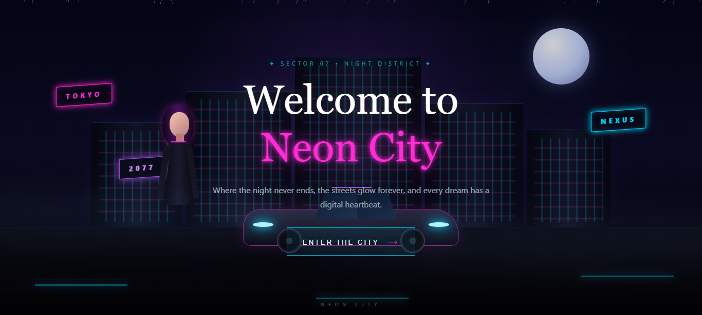

<p align="center">
  
</p>

# 404 Neon City

A cinematic cyberpunk-inspired 404 experience built with pure HTML, CSS, and JavaScript.

**404 Neon City** transforms a simple page-not-found experience into an atmospheric futuristic city scene, combining a layered skyline, neon lighting, rain, fog, animated road elements, interactive cursor particles, and a cinematic transition into the city.

## ✨ Features

* 🌃 **Cyberpunk Neon City Environment**
  A layered futuristic city scene built entirely with HTML and CSS.

* 🌙 **Atmospheric Moonlit Sky**
  A glowing moon and layered gradients create the nighttime atmosphere.

* 🏙️ **Layered City Skyline**
  Five individually styled buildings with generated neon window patterns.

* 💡 **Animated Neon Signs**
  Pink, blue, and purple neon signs with glow and flickering effects.

* 🚗 **CSS-Built Futuristic Car**
  A custom car constructed from CSS elements, including the roof, windows, headlights, body, and wheels.

* 👤 **CSS-Built Character**
  A stylized character assembled from individual CSS elements.

* 🌧️ **Dynamic Rain System**
  JavaScript generates 220 individual rain drops with randomized position, height, opacity, speed, and animation delay.

* 🌫️ **Animated Fog Effects**
  Layered fog elements continuously move across the scene to add atmospheric depth.

* 🛣️ **Animated Neon Road Lines**
  Glowing road lines move across the foreground using CSS animations.

* ✨ **Interactive Neon Cursor Particles**
  Mouse movement generates temporary pink and cyan particles around the cursor.

* 💗 **Neon Pulse & Glow Effects**
  Multiple elements use animated neon lighting, glow, and pulse effects.

* 🎯 **Interactive Enter the City Button**
  The button triggers a smooth fade-out transition before navigating to the root path.

* 📱 **Responsive Layout**
  A dedicated mobile breakpoint adjusts the scene, character, car, signs, typography, and content for smaller screens.

* ⚡ **Vanilla HTML, CSS & JavaScript**
  Built without front-end frameworks or UI libraries.

## 🛠️ Built With

| Technology     | Purpose                                                                        |
| -------------- | ------------------------------------------------------------------------------ |
| **HTML5**      | Scene structure and content                                                    |
| **CSS3**       | Layout, visual effects, animations, responsive behavior, and scene composition |
| **JavaScript** | Dynamic rain generation, cursor particles, and button interaction              |

## 📁 Project Structure

```text
404-Neon-City/
│
├── index.html
├── style.css
├── script.js
├── starvixhub-github-io-404-Neon-City.png
├── LICENSE
└── README.md
```

### `index.html`

Contains the structure of the Neon City scene, including the sky, moon, buildings, neon signs, character, car, road, rain container, fog layers, welcome content, and city title.

### `style.css`

Controls the complete visual presentation of the experience, including:

* City composition
* Moon and sky
* Buildings and windows
* Neon signs
* Character
* Futuristic car
* Road and animated road lines
* Rain styling
* Fog animation
* Neon effects
* Welcome interface
* Button states
* Responsive layout

### `script.js`

Handles the interactive and dynamic behavior:

* Generates the 220 rain drops
* Randomizes rain properties
* Creates cursor-following neon particles
* Handles the **ENTER THE CITY** interaction
* Applies the page fade-out transition
* Navigates to the root path

## 🎨 Design

The visual direction combines:

* Neon pink
* Electric blue
* Purple glow
* Dark night tones
* Futuristic architecture
* Rain and fog
* Cinematic lighting

The scene is designed as a single immersive viewport rather than a conventional website layout.

## 🚀 Getting Started

Clone the repository:

```bash
git clone https://github.com/Starvixhub/404-Neon-City.git
```

Open `index.html` in a modern browser to run the project locally.

No build process or package installation is required.

## 🌐 Deployment

The project is a static HTML/CSS/JavaScript experience and can be deployed directly to static hosting platforms such as GitHub Pages.

## Live Demo

- [🌐 GitHub Pages](https://starvixhub.github.io/404-Neon-City/)
- [🎨 CodePen](https://codepen.io/editor/sinarezaei/pen/01a0dfa3-1b87-7c59-8ad8-9b40cfbcc611)

## License

This project is licensed under the MIT License.

## 👤 Author

**StarvixHub**

Part of the StarvixHub creative front-end project collection.

```
